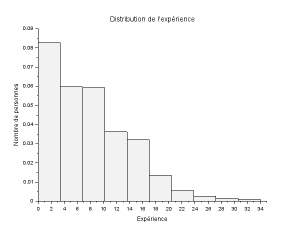

# Compte rendu SAÉ S2.04 (visualisation de données)

Ne pas oublier de lancer cette commande afin de bien récupérer les données nécessaire pour la réalisation des éxercices : 
```scilab
exec('setup.sce', -1)
```

## Exercice n°1 : 
1. Donnez sous forme de camembert la répartition des genres.
   - Faire la commande : 
   ```scilab
   exec('Ex1.1.sce', -1)
   ```
   
   - Proportion d'hommes : 0.5481415"
   - Proportion de femmes : 0.4497686"

2. Donnez sous forme d'histogramme la répartition des niveaux d'études, suivants le genre.
   - Faire la commande : 
   ```scilab
   exec('Ex1.2.sce', -1)
   ```
   
3. Donnez sous forme d'histogramme, les effectifs des 10 professions les plus représentées.
   - Faire la commande :
   ```scilab
   exec('Ex1.3.sce', -1)
   ```
  

   |Profession  |	Effectif|
   |:---        | :----
   |Senior Marketing Manager|		518|
   |Sales Director|		453
   |Senior Operations Analyst|		376|
   |Senior Engineer|		363
   |Junior Financial Analyst|		318|
   |Senior Project Coordinator|		313|
   |Network Engineer|		308|
   |Senior Marketing Manager|		255|
   |Senior Manager|		244
   |Director of Product Management|		244|

4. Quelle est la profession la plus fréquente des femmes ? des hommes ?
   - Faire la commande : 
   ```scilab
   exec('Ex1.4.sce', -1)
   ```
   - La profession la plus fréquente des hommes est : Software Engineer
   - La profession la plus fréquente des femmes est : Data Scientist


5. Pour chaque niveau d'études, donnez le salaire moyen, l'âge moyen et l'expérience moyenne.
   - Faire la commande : 
   ```scilab
   exec('Ex1.5.sce', -1) 
   ```
   |Niveau d'étude|Salaire moyen|Âge moyen|Expérience moyenne|
   |:-------------|:------------|:--------|:-----------------|
   |High School|118745.9|36.488839|9.9910714|
   |Bachelor|122468.91|33.468388|8.3656074|
   |Master|105941.16|32.475269|7.4139785|
   |phD|111258.61|34.58656|7.807889|
  
6. Pour chaque genre, donnez le salaire moyen, l'âge moyen et l'expérience moyenne.
   - Faire la commande : 
   ```scilab
   exec('Ex1.6.sce', -1)
   ```
   |Genre|Salaire moyen|Âge moyen|Expérience moyenne|
   |:----|:------------|:--------|:-----------------|
   |Female|121406.89|34.435974|8.6466359|
   |Male|107972.16|32.658408|7.4618434|
   |Other|115304.89|33.609574|8.077561|

## Exercice n°2 : 
   Ne pas oublier de lancer cette commande nécessaire à certaines questions de l'exercice : 
   ```scilab
   exec('fonctionMode.sci', -1)
   ```
1. Donnez sous forme d'histogrammes la distributions des ages.
   - Faire la commande : 
   ```scilab
   exec('Ex2.1.sce', -1)
   ```
   
2. Donnez sous forme d'histogrammes la distributions de l'expérience.
   - Faire la commande : 
   ```scilab
   exec('Ex2.2.sce', -1)
   ```
   

3. Donnez les quartiles, interquatiles, min,max, moyenne, mediane, mode, et ecart type de l'age.
   - Faire la commande : 
   ```scilab
   exec('Ex2.3.sce', -1)
   ```
   - Les premiers et troisième quartiles sont 28 et 38
   - L'écart interquartile est de 10
   - L'âge minimum est de 21
   - L'âge maximum est de 62
   - La moyenne d'âge est de 33
   - La médiane d'âge est de 32
   - Le mode de l'âge est de 27
   - L'écart-type de l'âge est de 7
4. A l'aide du paquet stixbox, tracez une boite à moustache pour l'age.
   - Faire la commande : 
   ```scilab
   exec('Ex2.4.sce', -1)
   ```
   

5. Refaire les questions précédentes pour l'expérience.
   - Faire la commande : 
   ```scilab
   exec('Ex2.5.sce', -1)
   ```
   - Les premiers et troisième quartiles sont 3 et 12
   - L'écart interquartile est de 9
   - L'expérience minimum est de 0
   - L'expérience maximum est de 34
   - La moyenne d'expérience est de 8
   - La médiane d'expérience est de 7
   - Le mode de l'expérience est de 2
   - L'écart-type de l'expérience est de 6
   

## Exercice n°3 : 
1. Donnez, sous forme d'histogramme la distribution des salaires, suivant le genre.
   - Faire la commande : 
   ```scilab
   exec('Ex3.1.sce', -1)
   ```
   

2. Tracez un histogramme des salaires moyens suivants le niveau d'études.
   - faire la commande : 
   ```scilab
   exec(Ex3.2.sce', -1)
   ```
   

3. Donnez les quartiles, interquatiles, min,max, moyenne, mediane, et ecart type des salaires. Tracez une boite à moustaches.
   - Faire la commande : 
   ```scilab
   exec('Ex3.3.sce', -1)
   ```
   Les premiers et troisième quartiles sont de 70000 et 160 000
   - L'écart interquartile est de 90000
   - Le salaire minimum est de 350
   - Le salaire maximum est de 250000
   - La moyenne de salaire est de 115326
   - La médiane de salaire est de 115000
   - Le mode de le salaire est de 140000
   - L'écart-type de le salaire est de 52786
   
   
4. Refaire la question précédente, en distingant les genres. Tracez une boîte à moustache pour chaque genre. Commentaires ?
   - Faire la commande : 
   ```scilab
   exec('Ex3.4.sce', -1)
   ```
   
    |Genre|Premier quartile|Troisième quartile|Écart interquartile|Salaire minimum|Salaire maximum|Moyenne du salaire|Médiande du salaire|Mode du salaire|Écart type du salaire|
    |:----|:---------------|:-----------------|:------------------|:--------------|:--------------|:----------------|:-------------------|:--------------|:--------------------|
    |Female|60000|150000|90000|500|220000|107888|105000|120000|52723|
    |Male|75000|170000|95000|350|250000|121389|120000|140000|52092|
    |Other|69032|161393|92361|62852|166109|125869|158610|158966|44242|

   - Commentaire : 
   On remarque que la boite à moustache des femmes est déplacée d'environ 25000 en moyenne par rapport à celle des hommes excepté pour la moustache du bas où les 2 se rapprochent de 0. L'échantillon Other est semblable aux autres mais la population de l'échantillon pose problème pour avoir une représentativité correcte.

## Exercice n°4 : 
1. Tracez un nuage de points (age,salaire), et la droite de regression correspondante. Quel est le coefficient de corrélation ?
    - Faire la commande : 
    ```scilab
    exec('Ex4.1.sce', -1)
    ```
    
    - Le coéfficient de corrélation est : 0.7280524

2. Tracez un nuage de points (expérience,salaire), et la droite de regression correspondante. Quel est le coefficient de corrélation ?
   - Faire la commande : 
   ```scilab
   exec('Ex4.2.sce', -1)
   ```
   
   - Le coefficient de corrélation est de 0.8088482

## Exercice n°5 : 
1. Tracez un nuage de points (salaire,expérience) pour les hommes et les femmes, ainsi que les droites de regression associées. Commentaire ?
   - Faire la commande : 
   ```scilab
   exec('Ex5.1.sce', -1)
   ````
   
   - Coefficient de corrélation pour les hommes: 0.8284456
   - Coefficient de corrélation pour les femmes: 0.7849322"
   - Commentaire : Le graphique révèle des tendances importantes sur l'impact de l'expérience sur le salaire pour les hommes et les femmes, et souligne l'existence d'un écart salarial significatif entre les genres.

2. Tracez un nuage de points (salaire,expérience) et les droites de regression associées pour chaque niveau d'études. Commentaire ?
   - Faire la commande : 
   ```scilab
   exec('Ex5.2.sce', -1)
   ```
   
   |Niveau d'éducation|Coefficient de corrélation|
   |:-----------------|:-------------------------|
   |High School|0.828732|
   |Bachelor|0.7746596|
   |Master|0.8092316|
   |phD|0.8862562|
   - Commentaire : Ce graphique montre que les personnes ayant des niveaux d'éducation plus élevés non seulement commencent avec des salaires plus élevés, mais voient aussi une augmentation plus rapide de leurs salaires avec l'expérience.
